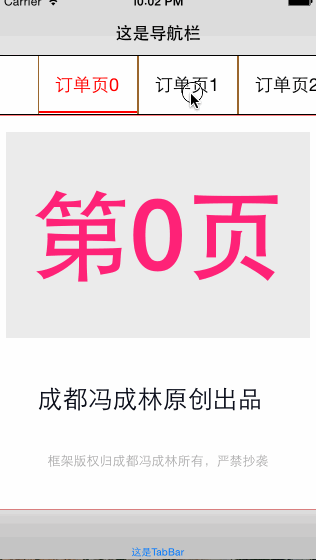
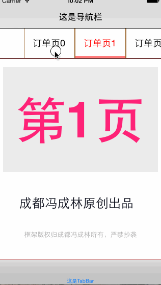

 
##### 中国.成都冯成林原创，请支持原创，谢谢            --- Charlin Feng

# CFPagesVC
    Professional Multi controller management Framework based on Swift

  
Chinese Fried Mention：
===============
 
#### 特别群：请西部省市朋友实名加入组织。其他地区朋友请添加2-4群：谢谢。
 
【西部区域】西部大开发群号： 473185026  -追赶北上广！为振兴西部IT而努力！ 
热烈欢迎中国西部各省市的从事iOS开发朋友实名进群！本群为是聚集西部零散开发者，大家齐心协力共进退！   

【全国可加】四群： 347446259 
新开，可加！欢迎全国朋友加入组织   

【全国可加】三群： 474377358 
新开，可加！欢迎全国朋友加入组织   

【全国可加】二群： 369870753 
**WORNING: 已爆满，加不上了**  

【全国可加】一群：163865401 
**WORNING: 已爆满，加不上了**  

   

Explain：
===============
Multi controller management based on CFPagesVC,Use CFPagesVC You can easily show your custom controller.
Here's another version of the OC that I wrote before.
CorePagesView: https://github.com/nsdictionary/CorePagesView.

The difference between these two versions is that CorePagesView is based on OC, the use of Scrollview is complete, while the CFPagesVC is based on Swift, and the clever use of CollectionView.

   
Function display
===============
 
#### No NavigationController, no TabbarController
 

  
#### Has NavigationController, no TabbarController
 

  
#### No NavigationController, has TabbarController
 

  
#### Has NavigationController, has TabbarController
 

  
#### More menu items need to be displayed and not to worry about it.
 

  
#### Dynamic calculation of menu length.
 

  
#### Code page jump control
 

Use
===============
  
#### 1.Obtain an instance
       
      let pagesVC = CFPagesVC.getInstance()

  
#### 2.Data using Closure transfer model

            var titles: [String] = ["已下单","订单","这个是用户的历史订单","库存信息","Massage","所有的订单信息"]
            
            for i in 0..<titles.count{
                
                let orderVC = OrderListVC(nibName: "OrderListVC", bundle: nil)
                
                orderVC.index = i
                
                let pm = CFPagesVC.PagesDataModel(pageVC: orderVC, desc: titles[i])
                
                pageDataModels.append(pm)
            }
            
            pagesVC.pageDataModels = pageDataModels

  
#### 3. Custom configuration
The default is fully automatic calculation, if you are willing, you can also configure, such as specifying the width and spacing, specify the spacing between the two sides of Scrollview, etc.

        /**  配置模型  */
        let configModel = CFPagesVC.PagesConfigModel(useStaticWidthWithBarViewH: 60, leftInset: 40, rightInset: 80, staticWidth: 100)
        pagesVC.pageConfigModel = configModel
        
 
Here are two models for you to choose, one is based on the length of the text automatically calculate the length of the menu text, you can specify additional width. The other one is set wide, you can also add additional width.

 
This class PagesConfigModel is in the CFPagesVC namespace, and he has these properties you can customize: 
>.barViewH --- Height of menu bar. 
>.leftInset --- The Scrollview menu's left inset. 
>.rightInset --- The Scrollview menu's right inset. 
>.useStaticWidth --- Use fixed width. 
>.barViewH --- Height of menu bar. 
>.staticWidth --- Fixed width value of fixed width. 
>.btnExtraWidth --- Extra width of menuBtn.

  
If you want to configure auto width, use

    init(useAutoWidthWithBarViewH barViewH: CGFloat,leftInset: CGFloat,rightInset: CGFloat, btnExtraWidth: CGFloat)
 

If you want to configure the fixed width, use the

    init(useStaticWidthWithBarViewH barViewH: CGFloat,leftInset: CGFloat,rightInset: CGFloat, staticWidth: CGFloat)
    
    

Life cycle
===============
Because of the use of collectionview，CFPagesVC management of your custom controller, has a strict logical life cycle，
In the custom controller inside, I print the life cycle of the process, you can view the output of the Xcode console, understand the process of switching the controller in your master, master their life cycle
    
License
===============
This project is made available under the MIT license. See LICENSE.txt for details.
